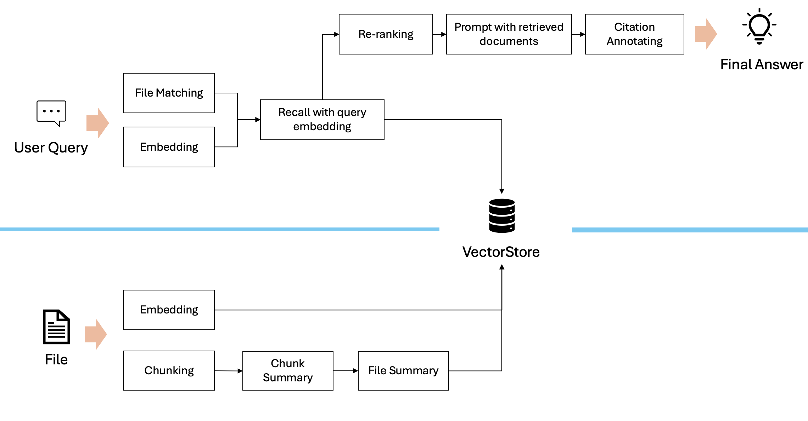

# Assistant API

## Architecture overview

* `http-api` for restful endpoints
* `task-queue` for agent execution
* `tool-server`
  * multi-tenant vectordb for `file-search`
  * python sandbox for `code-interpreter` 

## http-api

OAS for assistant API can be found here: https://github.com/openai/openai-openapi

In first release of `mini-assistant`, following endpoints are supported:

* Assistant
  * POST `/assitants`
  * GET `/asstants/:assistant_id`
  * GET `/assistants`
  * POST `/asstants/:assistant_id`
  * DELETE `/assistants/:assitant_id`
* Thread
  * POST `/threads`
  * GET `/threads/:thread_id`
  * POST `/threads/:thread_id`
  * DELETE `/threads/:thread_id`
* Message
  * POST `/threads/:thread_id/messages`
  * GET `/threads/:thread_id/messages/:message_id`
  * GET `/threads/:thread_id/messages`
  * POST `/threads/:thread_id/messages/:message_id`
* Run
  * POST `/threads/:thread_id/runs`
  * POST `/threads/:thread_id/runs/:run_id`
  * GET `/threads/:thread_id/runs`
  * POST `/threads/:thread_id/runs/:rund_id/submit_tool_outputs`
  * POST `/threads/:thread_id/runs/:run_id/cancel`
  * POST `/threads/runs`
* RunStep
  * GET `/threads/:thread_id/runs/:run_id/steps`
  * GET `/threads/:thread_id/runs/:run_id/steps/:step_id`
* File
  * GET `/files`
  * POST `/files`
  * DELETE `/files/:file_id`
  * GET `/files/:file_id`
  * GET `/files/:file_id/content`
* VectorStore
  * POST `/v1/vector_stores/`
  * GET `/v1/vector_stores/`
  * GET `/v1/vector_stores/:vector_store_id`
  * POST `/v1/vector_stores/:vector_store_id`
  * DELETE `/v1/vector_stores/:vector_store_id`
  * GET `/v1/vector_stores/:vector_store_id/files`
  * POST `/v1/vector_stores/:vector_store_id/files`
  * GET `/v1/vector_stores/:vector_store_id/files/:file_id`
  * DELETE `/v1/vector_stores/:vector_store_id/files/:file_id`
  * POST `/v1/vector_stores/:vector_store_id/file_batches`
  * GET `/v1/vector_stores/:vector_store_id/file_batches/:batch_id`
  * POST `/v1/vector_stores/:vector_store_id/file_batches/:batch_id/cancel`
  * GET `/v1/vector_stores/:vector_store_id/file_batches/:batch_id/files`

## task-queue 

In `mini-assistant`, an in-process, multi-consumer task queue is created. See [ThreadPoolTaskScheduler.hpp](../modules/instinct-data/include/task_scheduler/ThreadPoolTaskScheduler.hpp) for more details.

Primary task handler classes are:

* [FileObjectTaskHandler.hpp](../modules/instinct-assistant/include/assistant/v2/task_handler/FileObjectTaskHandler.hpp): To process uploaded file.
* [RunObjectTaskHandler.hpp](../modules/instinct-assistant/include/assistant/v2/task_handler/RunObjectTaskHandler.hpp): To execute a run request for threads.

`ThreadPoolTaskScheduler` is kind of  `ILifeCycle` and it's bootstrap in main.

## tool-server

### file-search

Primary classes:

* [SummaryGuidedFileSearch.hpp](../modules/instinct-assistant/include/assistant/v2/toolkit/SummaryGuidedFileSearch.hpp): Actual implementation of search tool
* [RunObjectTaskHandler.hpp](../modules/instinct-assistant/include/assistant/v2/task_handler/RunObjectTaskHandler.hpp): Bring the search tool to user's run requests.

Search pipeline:

### code-interpreter

Prompting is straightforward. The challenge would the sandbox for Python scripts.

Basically two ways for sandboxes:

* Container with official Python binaries. 
  * [E2B sandbox](https://e2b.dev/docs/sandbox/overview).
  * https://github.com/significant-gravitas/autogpt/blob/master/autogpts/autogpt/autogpt/commands/execute_code.py
  * https://github.com/engineer-man/piston
  * https://github.com/StepicOrg/epicbox
* WebAssembly port of Python and run with a WebAssembly runtime. 
  * [Pyodide](https://pyodide.org/en/stable/index.html).
  * Sandbox engine using https://github.com/cohere-ai/cohere-terrarium

For `mini-assistant`, we will try script execution without sandbox first. And then try the WebAssembly way as it's possible to embed a working runtime without additional Docker or containerd setup.

For scalable solution, container-based solution is definitely the way to go as it can easily leverage cloud-native technologies like Kubernetes and KNative.

